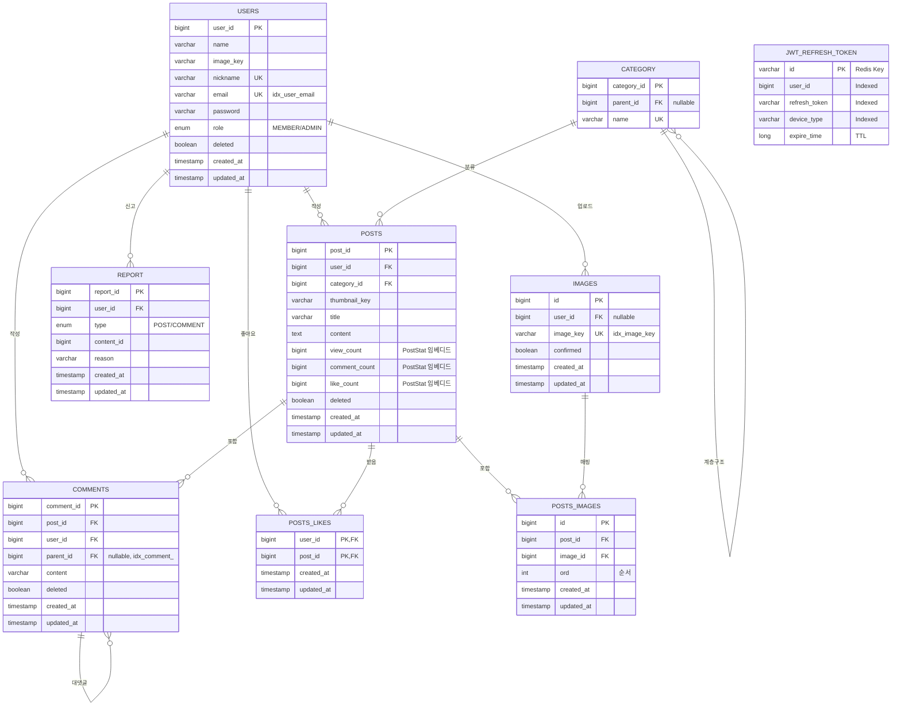

## 🚀 소개


---

## 🧰 기술 스택

**백엔드**
* **Java 21**, **Spring Boot 3.56**
* Spring Web, Spring Validation, Spring Data JPA, Spring Security
* **JWT**(Access/Refresh) – 쿠키 발급
* **QueryDSL** – 동적 조회
* **MySQL** (InnoDB), **Redis**, **S3**
* Gradle, Docker

**인프라**
* **AWS EC2**, **ALB**, **API Gateway**
* **ElastiCache**, **RDS**
* **ECR**, **Code Deploy**
* **Grafana**, **Prometheus**

---

## 시연 영상
https://youtu.be/-OU1zNI22rg?si=DQVjqFTWri5dhAem

---

## 💡서비스 기능 및 이유 설명

### 🔐 인증/보안
* 요청 시 JWT 검증 필터가 토큰을 확인하여 인증
* 로그인 성공 시 Access Token을 헤더로 발급
* Refresh Token을 쿠키로 발급 (HttpOnly, Secure, SameSite 설정)
  * 토큰의 상태 관리를 위해서 Redis 구현

---

### 🖼️ 이미지 업로드 정책
* 클라이언트가 이미지 파일명을 보내면 서버가 Pre‑Signed URL 반환
* 클라이언트는 해당 URL로 S3에 직접 업로드
  *   서버의 부하를 방지하고자 프런트 측에서 호출

---
### 🔁 무한스크롤 규칙
* 리스트 API는 lastId, size 쿼리 파라미터를 사용
  *   기존 페이지네이션에서의 Offset 성능저하의 단점을 극복하고자, lastId기반의 QueryDSL 기반 쿼리문 작성 

---

### ⏰ 배치 처리 스케줄링

#### 1. 고아 이미지 자동 삭제
**처리 내용**:
- S3에 업로드되었지만 게시글에 사용되지 않은 이미지(confirmed=false) 자동 삭제
- Pre-Signed URL로 업로드 후 게시글 작성을 완료하지 않은 경우 발생하는 고아 이미지 정리
- S3 스토리지 비용 절감 및 불필요한 리소스 제거

#### 2. 게시글 통계 동기화 (PostBatchService)
**처리 내용**:
- Redis에 캐싱된 게시글 통계(조회수, 댓글수, 좋아요수)를 DB에 동기화
- 100개 단위 청크로 트랜잭션 처리하여 대용량 데이터 안정적 처리
- 동기화 완료 후 해당 Redis 키 자동 삭제

---

## 📁 백엔드 프로젝트 구조

```
project
├─ global/              # 공통 예외, 응답 래퍼, 설정
├─ security/            # JWT, 인증/인가 필터, 핸들러
├─ platform/
│  ├─ user/             # 유저 도메인 (회원가입/로그인/마이페이지)
│  ├─ posts/            # 게시글 도메인
│  ├─ comments/         # 댓글 도메인
│  └─ images/           # 이미지(Pre‑Signed URL 발급)
└─ ...
```
---

## 📊 백엔드 ERD (Entity Relationship Diagram)



#### 인덱스 전략
- `idx_user_email`: 로그인 시 이메일 기반 빠른 조회
- `idx_comment_`: 대댓글 조회 최적화
- `idx_image_key`: S3 키 기반 이미지 검색 최적화

--- 
## 🔨프로젝트 인프라 아키텍쳐

* AWS 3-tier 아키텍쳐 구현

### 퍼블릭 서브넷

### 프라이빗 서브넷

### ECR 구조

## 멀티 스테이징 도커파일 구성


## CICD 파이프라인 구조도


## 블루/그린 배포


